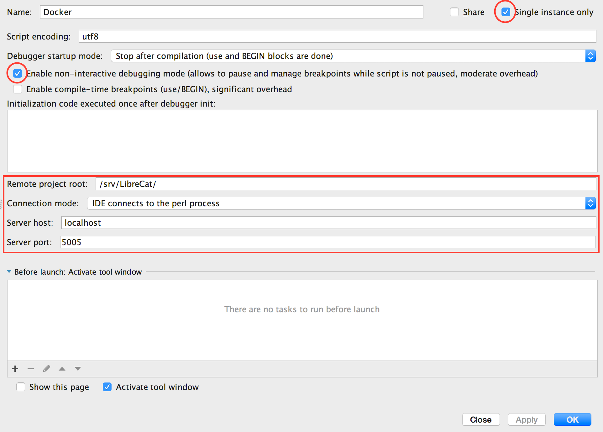

# PUB/LibreCat docker image

There is already a documentation how to install and use this bundle in the wiki. Here you can find the **Release-Notes**:

# Development Workflow

## Setup

  To speed up the build of a development container, which only contains Göttingen specific changes, there are now two Docker images, a base image and a dev image.
  **You need to keep in mind, that you need to rebuild both images if you want to pull in changes made to the master branch of LibreCat.**
  First run:

    $ docker build --tag librecat_base --force-rm -f Dockerfile_Base .

 And then (also if there would be any changes, you just need to rebuild the last images):

    $ docker build --no-cache --tag librecat --force-rm -f Dockerfile_Dev .

##Starting

  Afterwards you might start the sytem without any debugger support.

    $ docker-compose up

## Using a debugger

  You can also attach a IDE with Perl debugger, currently the [Camelcade Debugger](https://github.com/Camelcade) is supported, we recommend [IntelliJ IDEA](https://www.jetbrains.com/idea/)
  
  First you need to set up the source files, to do the you just need to run a script which pulls together the sources and Perl modules from GitHub and CPAN in a structure similar to the one inside the container. You just need to run

    $ ./setup-dev.sh

  After this you need to follow the instruchtions for setting up a new project in the [Camelcade Wiki](https://github.com/Camelcade/Perl5-IDEA/wiki/Getting-started:-IntelliJ-IDEA). Use this directory as the root for the new project and create a module with the contents of the `src` populated by the script.

  The next step is to set up a debug configuration as in the screen shot.

  Then start the system with a modified call of `docker-compose`:

    $ docker-compose -f docker-compose.yml -f docker-compose.dev.yml up 

  After that wait until you see a line that the debugger is waiting for connections and launch the debug configuration from IntelliJ IDEA (screenshot above). You should see the position where the execution of the scripts starts.

# Release Notes

## 2016.11.02
  Added a script which pulls together the sources from GitHub and CPAN, which can be used in the debugger. You just need to run

    $ ./setup-dev.sh
    
And then follow the instruchtions for setting up a new project in the [Camelcade Wiki](https://github.com/Camelcade/Perl5-IDEA/wiki/Getting-started:-IntelliJ-IDEA). Use this directory as the root for the new project and create a module with the contents of the `src` populated by the script.

## 2016.10.31
 Now we have a Perl debugger integrated with docker, to run with the debugger just start with:

    $ docker-compose -f docker-compose.yml -f docker-compose.dev.yml up

Learn how to set up your IDE at the [Camelcade Wiki](https://github.com/Camelcade/Perl5-IDEA/wiki)

## 2016.10.20
 Now there is a boot-script as well as layer-config which has been introduced by the end of September. Besides, the volumes(=external folders) per default in the `docker-compose.yml` file.

## 2016.09.26
 For now we abondoned the notion of having **OpenSSH-Server** inside docker. Right now having a working system based on orignal development of [LibreCat Core-Developers](https://github.com/LibreCat/LibreCat) is highly prioritized. Thus in the new version the git-repository of LibreCat -not our fork!- will be used with our layer and extras on top of that.

## 2016.09.05

 Another feature: Now there is a **OpenSSH-Server** inside the Image, which will help in establishing a
developement procedure. If you want to use this in production, just change the password for the _librecat_.

## 2016.08.24

 In order to make the development faster, we decided to break-apart the Dockerfiles. With this, before you
use `docker-compose` to start the bundle, you need to first create a **Base**-Image of it:

    $ docker build --tag librecat_base --force-rm -f Dockerfile_Base .

Afterwards is the same as before:

    $ docker-compose up

Now, if there would be any changes, you just need to rebuild the last images:

    $ docker build --no-cache --tag librecat --force-rm -f Dockerfile_Dev .

_Note:_ If you create the Base image under another name, you should just change the `From`-line in `Dockerfile` to the proper Image-Name.

Obviously you could still do everything in one single step:

    $ docker build --no-cache --tag librecat --force-rm -f Dockerfile_Full .

## 2016.06.23

 `docker-compose` with `centos` is moved to `centos-compose`. There are SymLinks to related folders created
there. If the links won't work you may want to copy two folders `mysql` and `elasticsearch` from root up there.

 There is an `ubuntu` standalone version under `ubuntu` zu finden. The current `docker-compose` is based on `ubuntu`
and `elasticsearch`. In order to make everthing work, just follow these simple steps:

    $ git clone https://github.com/subugoe/pub_dev
    $ cd pub_dev
    $ docker-compose up -d

 **NOTE**: Remember to change the **MYSQL_PASSWORD** and/or **MYSQL_ROOT_PASSWORD** to something else before you put the bundle
online.

## 2016.06.15

The 1st `docker-compose` version is ready:

    $ docker-compose up -d

after a while you can access the LibreCat as usual under:

    http://localhost:5001/

## 2016.06.08

As of right now only the centOS version is functional. Though it will take a while, one Dockerfile suffices
building the functional Image:

    $ docker build -t librecat --force-rm .

Regards,

A. and C.
